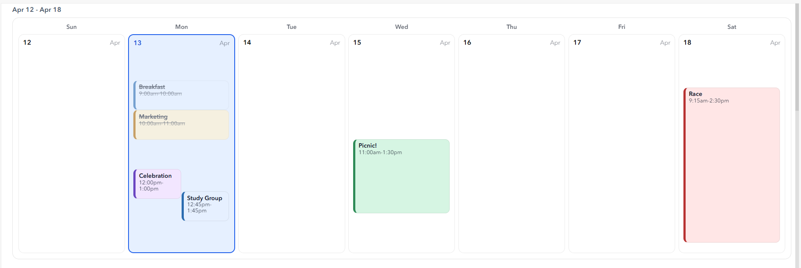
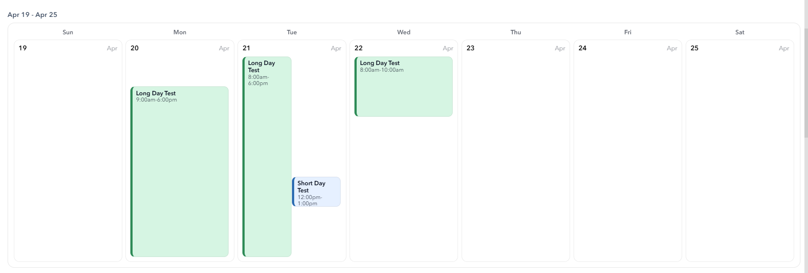
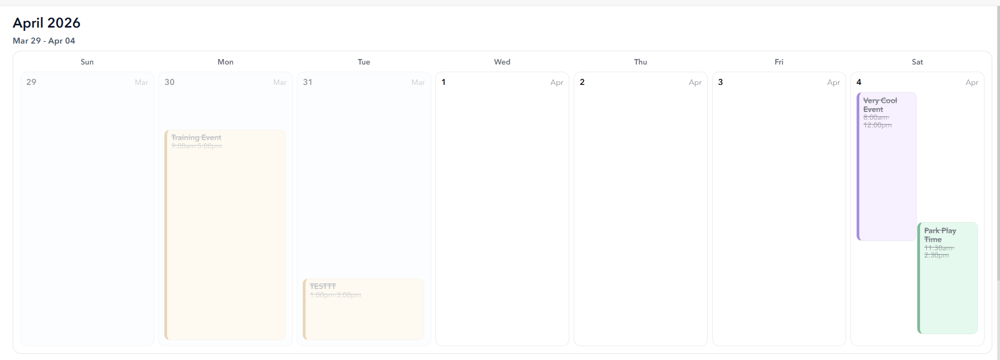

# Calendars with Arcade

## Background
All credits to Grace Fernandez. Also found in the PS Codex (link TBD)

## Code
``` javascript linenums="1" title="Arcade"
/*
Weekly Calendar rows (12 months) with OVERLAPPING EVENT BLOCKS per day cell
ArcGIS Online Dashboards - Data Expression profile

Features:
- Auto-expand time window per WEEK (consistent vertical scale across 7 days)
- Split events into overlap clusters (connected overlap groups)
- Outlook-style "column spanning": within a cluster, events expand into free columns to the right
- dayEvents dict stores STRING per day (NOT arrays) => stable in Dashboards
- no Push() anywhere
*/

var PORTAL_URL  = "https://haps.maps.arcgis.com/";
var ITEM_ID     = "24b70c57c7be410bb749a8bda1dc4fa0";
var LAYER_INDEX = 0;

// --- FIELD NAMES ---
var FIELD_NAME  = "event_name";
var FIELD_TYPE  = "event_type";
var FIELD_START = "start_date_time";
var FIELD_END   = "end_date_time";   // set to "" if you don't have an end field

// Behavior
var EXPAND_SPANS  = true;
var MAX_SPAN_DAYS = 62;

// Default rendering window (auto-expand beyond these when needed)
var DAY_START_HOUR = 8;
var DAY_END_HOUR   = 18;

// Visual scale
var PX_PER_MIN     = 0.9;//0.75;

// Window rounding
var ROUND_MINUTES  = 30;

// Maximum height for a day column (prevents very tall weeks)
var MAX_DAY_HEIGHT_PX = 360;   // try 300–420 depending on your dashboard
var ALLDAY_THRESHOLD_MIN = 12 * 60;
/* ============================
   DATE HELPERS
   ============================ */

function LocalDateOnly(d){
  var l = ToLocal(d);
  return Date(Year(l), Month(l), Day(l));
}
function DayKey(d){
  return Text(LocalDateOnly(d), "YYYY-MM-DD");
}
function MonthKey(d){
  return Text(LocalDateOnly(d), "YYYY-MM");
}
function MonthLabel(d){
  return Text(LocalDateOnly(d), "MMMM Y");
}
function WeekStartSunday(d){
  var x = LocalDateOnly(d);
  return DateAdd(x, -Weekday(x), "days"); // Sun=0 ... Sat=6
}
function WeekLabelFromStart(ws){
  var s = LocalDateOnly(ws);
  var e = LocalDateOnly(DateAdd(ws, 6, "days"));
  return Text(s, "MMM DD") + " - " + Text(e, "MMM DD");
}
function InSameMonth(d, monthStart){
  var x = LocalDateOnly(d);
  var m = LocalDateOnly(monthStart);
  return Year(x) == Year(m) && Month(x) == Month(m);
}
function IsToday(d){
  var x = LocalDateOnly(d);
  var t = LocalDateOnly(Today());
  return Year(x) == Year(t) && Month(x) == Month(t) && Day(x) == Day(t);
}

/* ============================
   TEXT / STYLE HELPERS
   ============================ */

function HtmlEscape(v){
  if (IsEmpty(v)) return "";
  var s = Text(v);
  if (IsEmpty(s)) return "";
  s = Replace(s, "&", "&amp;");
  s = Replace(s, "<", "&lt;");
  s = Replace(s, ">", "&gt;");
  s = Replace(s, "\"", "&quot;");
  s = Replace(s, "'", "&#39;");
  return s;
}
function DelimSafe(v){
  var s = HtmlEscape(v);
  s = Replace(s, "|", "/");
  s = Replace(s, "~", "-");
  return s;
}
function SafeText(v, fallback){
  return IIf(IsEmpty(v), fallback, Text(v));
}
function TypeColor(typeText){
  var t = Lower(IIf(IsEmpty(typeText), "", typeText));
  return When(
    Find("parks", t) >= 0, "#D6F5E3",
    Find("training", t) >= 0, "#FFF0CC",
    Find("meeting",  t) >= 0, "#E6F0FF",
    Find("special events", t) >= 0, "#F2E6FF",
    Find("athletic", t) >= 0, "#FFE6E6",
    "#EEF2F6"
  );
}
function TypeBorder(typeText){
  var t = Lower(IIf(IsEmpty(typeText), "", typeText));
  return When(
    Find("parks", t) >= 0, "#2E8B57",
    Find("training", t) >= 0, "#B36B00",
    Find("meeting",  t) >= 0, "#2B6CB0",
    Find("special events", t) >= 0, "#6B46C1",
    Find("athletic", t) >= 0, "#B83232",
    "#94A3B8"
  );
}
function MinToLabel(minFromMidnight){
  var h24 = Floor(minFromMidnight / 60);
  var m = minFromMidnight - h24 * 60;

  var ap = IIf(h24 >= 12, "pm", "am");
  var h = h24 % 12;
  if (h == 0) h = 12;

  var mm = IIf(m < 10, "0" + Text(m), Text(m));
  return Text(h) + ":" + mm + ap;
}
function RoundDown(mins, step){ return Floor(mins / step) * step; }
function RoundUp(mins, step){ return Ceil(mins / step) * step; }

function Overlaps(a, b){
  // strict overlap test in "window-relative minutes"
  return (a.st < b.et) && (a.et > b.st);
}

/* ============================
   OUTLOOK-STYLE ASSIGN + SPAN + RENDER
   NOTE: Defined OUTSIDE RenderOverlapsForDay (Arcade requirement)
   items: array of event objects for the day (already window-relative st/et)
   uses items[sIdx..eIdx] inclusive
   ============================ */

function AssignColsAndRender(items, sIdx, eIdx, windowStartMinAbs, containerH){

  // 1) Assign columns greedily for this overlap cluster
  var activeEnds = [];   // activeEnds[col] = end minute (relative) for last event in col
  var maxCols = 0;

  for (var k = sIdx; k <= eIdx; k++){
    var it = items[k];

    var col = 0;
    var found = 0;

    for (var c = 0; c < Count(activeEnds); c++){
      if (activeEnds[c] <= it.st){
        col = c;
        found = 1;
        break;
      }
    }
    if (found == 0){
      col = Count(activeEnds);
      activeEnds[col] = 0;
    }

    activeEnds[col] = it.et;
    it.col = col;
    items[k] = it;

    maxCols = Max(maxCols, Count(activeEnds));
  }

  if (maxCols < 1) maxCols = 1;

  // 2) Build per-column index lists for span checks
  var colEvents = [];
  for (var c2 = 0; c2 < maxCols; c2++){
    colEvents[c2] = [];
  }

  for (var j = sIdx; j <= eIdx; j++){
    var cc = items[j].col;
    var lst = colEvents[cc];
    lst[Count(lst)] = j;      // append index
    colEvents[cc] = lst;
  }

  // 3) Compute Outlook-style "span" for each event:
  //    Expand into consecutive columns to the right if NO event in that column overlaps this event.
  for (var j2 = sIdx; j2 <= eIdx; j2++){
    var ev = items[j2];
    var span = 1;

    for (var nextCol = ev.col + 1; nextCol < maxCols; nextCol++){
      var ok = 1;
      var idxs = colEvents[nextCol];

      for (var t = 0; t < Count(idxs); t++){
        var other = items[idxs[t]];
        if (Overlaps(ev, other)){
          ok = 0;
          break;
        }
      }

      if (ok == 1) span++;
      else break; // stop at first blocking column
    }

    ev.span = span;
    items[j2] = ev;
  }

  // 4) Render this cluster using its cluster column count (maxCols),
  //    but event widths use their computed spans.
  var colW = 100 / maxCols;
  var html = "";

  for (var q = sIdx; q <= eIdx; q++){
    var x = items[q];

    // var topPx = x.st * PX_PER_MIN;
    // var hPx   = Max(18, (x.et - x.st) * PX_PER_MIN);
    var topPx = x.st * PX_PER_MIN;

    // raw height based on duration
    var rawHPx = (x.et - x.st) * PX_PER_MIN;

    // maximum height allowed inside the day cell
    var maxHPx = containerH - topPx;

    // clamp height so it never exceeds the cell
    var hPx = Max(18, Min(rawHPx, maxHPx));
    var leftP = x.col * colW;
    var widthP = x.span * colW;

    // small gutter so blocks don't visually fuse
    // (gutter is inside by reducing width slightly)
    var widthAdj = Max(0, widthP - 0.6);

    var opacity = IIf(x.past == 1, 0.60, 1);
    var strike = IIf(x.past == 1, "text-decoration:line-through;", "")
    var t0 = MinToLabel(windowStartMinAbs + x.st);
    var t1 = MinToLabel(windowStartMinAbs + x.et);
    var tTxt = t0 + "-" + t1;
    
    html +=
      "<div style='position:absolute;" +
        "top:" + Text(topPx) + "px;" +
        "height:" + Text(hPx) + "px;" +
        "left:" + Text(leftP) + "%;" +
        "width:" + Text(widthAdj) + "%;" +
        "box-sizing:border-box;" +
        "padding:6px 6px;" +
        "border-radius:8px;" +
        "background:" + x.bg + ";" +
        "border-left:4px solid " + x.bd + ";" +
        "border-top:1px solid rgba(0,0,0,0.08);" +
        "border-right:1px solid rgba(0,0,0,0.08);" +
        "border-bottom:1px solid rgba(0,0,0,0.08);" +
        "overflow:hidden;" +
        "opacity:" + Text(opacity) + ";" +
        strike +
      "'>" +
        "<div style='font-size:11px;font-weight:800;line-height:1.15;'>" + x.nm + "</div>" +
        "<div style='font-size:10px;opacity:0.8;line-height:1.1;'>" +tTxt +
          //IIf(IsEmpty(x.tp), "", x.tp + " • ") + tTxt +
        "</div>" +
      "</div>";
  }

  return html;
}

/* ============================
   QUERY SOURCE
   ============================ */

var qFields = [FIELD_NAME, FIELD_TYPE, FIELD_START];
if (!IsEmpty(FIELD_END)){
  qFields[Count(qFields)] = FIELD_END;
}

var fs = OrderBy(
  FeatureSetByPortalItem(
    Portal(PORTAL_URL),
    ITEM_ID,
    LAYER_INDEX,
    qFields,
    false
  ),
  FIELD_START + " ASC"
);

/* ============================
   BUILD DATE WINDOW (12 MONTHS)
   ============================ */

var rangeStart = Date(Year(Today()), Month(Today()), 1);
var rangeEnd   = DateAdd(rangeStart, 12, "months"); // exclusive

var calendarStart = WeekStartSunday(rangeStart);
var lastWeekStart = WeekStartSunday(DateAdd(rangeEnd, -1, "days"));
var calendarEnd   = DateAdd(lastWeekStart, 7, "days"); // exclusive

/* ============================
   dayEvents dict (STRING per day)
   encodedEvent:
     nm|tp|stMin|etMin|bg|bd|past
   ============================ */

var dayEvents = {};

// seed all days so empty days always render
var cur = calendarStart;
while (cur < calendarEnd){
  dayEvents[DayKey(cur)] = "";
  cur = DateAdd(cur, 1, "days");
}

function AppendEventString(dict, key, enc){
  if (!HasKey(dict, key) || IsEmpty(dict[key])) dict[key] = "";
  dict[key] = dict[key] + enc + "~~";
}
function EncodeEvent(nm, tp, stMin, etMin, bg, bd, past){
  return DelimSafe(nm) + "|" +
         DelimSafe(tp) + "|" +
         Text(stMin) + "|" +
         Text(etMin) + "|" +
         bg + "|" +
         bd + "|" +
         Text(past);
}

// ingest events (precompute minutes since midnight local)
for (var e in fs){

  var sdRaw = e[FIELD_START];
  if (IsEmpty(sdRaw) || TypeOf(sdRaw) != "Date") continue;

  var edRaw = sdRaw;
  if (!IsEmpty(FIELD_END) && HasKey(e, FIELD_END)){
    var tmp = e[FIELD_END];
    if (!IsEmpty(tmp) && TypeOf(tmp) == "Date") edRaw = tmp;
  }

  var stL = ToLocal(sdRaw);
  var etL = ToLocal(edRaw);
  if (etL <= stL) etL = DateAdd(stL, 30, "minutes");

  var stDate = LocalDateOnly(stL);
  var etDate = LocalDateOnly(etL);

  var nm = SafeText(e[FIELD_NAME], "Unnamed Event");
  var tp = SafeText(e[FIELD_TYPE], "");

  var bg = TypeColor(tp);
  var bd = TypeBorder(tp);
  var past = IIf(edRaw < Now(), 1, 0);

  var spanDays = DateDiff(etDate, stDate, "days");
  var cap = 1;
  if (EXPAND_SPANS && spanDays > 0){
    cap = Min(MAX_SPAN_DAYS, spanDays + 1);
  }

  for (var j = 0; j < cap; j++){
    var d = DateAdd(stDate, j, "days");
    if (d < calendarStart || d >= calendarEnd) continue;

    var dayMid = Date(Year(d), Month(d), Day(d), 0, 0, 0);
    var nextMid = DateAdd(dayMid, 1, "days");

    var occStart = IIf(stL > dayMid, stL, dayMid);
    var occEnd   = IIf(etL < nextMid, etL, nextMid);
    if (occEnd <= occStart) continue;

    var stMin = Hour(occStart) * 60 + Minute(occStart);
    var etMin = Hour(occEnd) * 60 + Minute(occEnd);
    if (occEnd == nextMid) etMin = 1440;
    if (etMin <= stMin) etMin = Min(1440, stMin + 30);

    AppendEventString(dayEvents, DayKey(d), EncodeEvent(nm, tp, stMin, etMin, bg, bd, past));
  }
}

/* ============================
   OVERLAP RENDERER (clusters + spanning)
   ============================ */

function RenderOverlapsForDay(encodedStr, windowStartMinAbs, windowEndMinAbs){

  if (IsEmpty(encodedStr)) return "";

  windowStartMinAbs = Max(0, Min(1440, windowStartMinAbs));
  windowEndMinAbs   = Max(0, Min(1440, windowEndMinAbs));
  var totalMin = windowEndMinAbs - windowStartMinAbs;
  if (totalMin <= 0) return "";
  
  var rawHeight = totalMin * PX_PER_MIN;
  var containerH = Min(rawHeight, MAX_DAY_HEIGHT_PX);
  //var containerH = totalMin * PX_PER_MIN;

  // Parse events into items (window-relative minutes)
  var parts = Split(encodedStr, "~~");
  var items = [];

  for (var i = 0; i < Count(parts); i++){
    var p = parts[i];
    if (IsEmpty(p)) continue;

    var f = Split(p, "|");
    if (Count(f) < 7) continue;

    var stMin = Number(f[2]);
    var etMin = Number(f[3]);

    // clamp to week window
    var stW = Max(windowStartMinAbs, Min(windowEndMinAbs, stMin));
    var etW = Max(windowStartMinAbs, Min(windowEndMinAbs, etMin));

    // skip outside window; or minimum if intersects
    if (etW <= stW){
      if (stMin < windowEndMinAbs && etMin > windowStartMinAbs){
        etW = Min(windowEndMinAbs, stW + 30);
      } else {
        continue;
      }
    }

    items[Count(items)] = {
      st: stW - windowStartMinAbs,
      et: etW - windowStartMinAbs,
      nm: f[0],
      tp: f[1],
      bg: f[4],
      bd: f[5],
      past: Number(f[6]),
      col: 0,
      span: 1
    };
  }

  var n = Count(items);
  if (n == 0) return "";

  // Sort by start then end (insertion sort)
  for (var a = 1; a < n; a++){
    var key = items[a];
    var b = a - 1;
    while (b >= 0){
      var cur = items[b];
      if (cur.st < key.st || (cur.st == key.st && cur.et <= key.et)) break;
      items[b + 1] = cur;
      b = b - 1;
    }
    items[b + 1] = key;
  }

  // Split into overlap clusters using sweep
  var blocksHtml = "";

  var sIdx = 0;
  var curEnd = items[0].et;

  for (var i2 = 1; i2 < n; i2++){
    if (items[i2].st < curEnd){
      curEnd = Max(curEnd, items[i2].et);
    } else {
      // render cluster [sIdx..i2-1]
      blocksHtml += AssignColsAndRender(items, sIdx, i2 - 1, windowStartMinAbs,containerH);
      sIdx = i2;
      curEnd = items[i2].et;
    }
  }
  // last cluster
  blocksHtml += AssignColsAndRender(items, sIdx, n - 1, windowStartMinAbs,containerH);

  return "<div style='position:relative;height:" + Text(containerH) + "px;width:100%;'>" + blocksHtml + "</div>";
}

/* ============================
   WEEK HTML BUILDER (auto-expand window per week)
   ============================ */

function BuildWeekHTML(monthStart, weekStart, dayEventsDict){

  var dow = ["Sun","Mon","Tue","Wed","Thu","Fri","Sat"];

  /* ----------------------------
     Header (Sun–Sat)
     ---------------------------- */
  var header =
    "<div style='display:grid;grid-template-columns:repeat(7,1fr);gap:6px;margin-bottom:6px;'>";
  for (var i = 0; i < 7; i++){
    header +=
      "<div style='font-size:11px;font-weight:800;text-align:center;opacity:0.65;'>" +
        dow[i] +
      "</div>";
  }
  header += "</div>";

  /* ----------------------------
     AUTO WINDOW CALC (per week)
     ---------------------------- */

  var baseStart = DAY_START_HOUR * 60;
  var baseEnd   = DAY_END_HOUR * 60;

  var weekMin = baseStart;
  var weekMax = baseEnd;

  // NEW: detect all‑day / multi‑day‑like events
  var hasAllDayLike = 0;

  // scan all 7 days for earliest start / latest end
  for (var s = 0; s < 7; s++){
    var d0 = DateAdd(weekStart, s, "days");
    var dk0 = DayKey(d0);

    var evStr0 = IIf(HasKey(dayEventsDict, dk0), dayEventsDict[dk0], "");
    if (IsEmpty(evStr0)) continue;

    var parts0 = Split(evStr0, "~~");
    for (var p = 0; p < Count(parts0); p++){
      var token = parts0[p];
      if (IsEmpty(token)) continue;

      var f = Split(token, "|");
      if (Count(f) < 4) continue;

      var stMin = Number(f[2]);
      var etMin = Number(f[3]);

      weekMin = Min(weekMin, stMin);
      weekMax = Max(weekMax, etMin);

      // NEW: all‑day‑like detection
      var dur = etMin - stMin;
      if (dur >= ALLDAY_THRESHOLD_MIN){
        hasAllDayLike = 1;
      }
    }
  }

  // round to clean boundaries
  weekMin = RoundDown(weekMin, ROUND_MINUTES);
  weekMax = RoundUp(weekMax, ROUND_MINUTES);

  // clamp to valid day range
  weekMin = Max(0, Min(1440, weekMin));
  weekMax = Max(0, Min(1440, weekMax));

  // NEW: prevent all‑day events from exploding height
  if (hasAllDayLike == 1){
    weekMin = Max(weekMin, baseStart);
    weekMax = Min(weekMax, baseEnd);
  }

  // enforce a minimum visible window
  if (weekMax - weekMin < 60){
    weekMax = Min(1440, weekMin + 60);
  }

  /* ----------------------------
     Build the 7 day cells
     ---------------------------- */

  var cellsHtml = "";

  for (var i2 = 0; i2 < 7; i2++){
    var d = DateAdd(weekStart, i2, "days");
    var dk = DayKey(d);

    var inMonth = InSameMonth(d, monthStart);
    var today   = IsToday(d);

    var bg = When(
      today, "#E6F0FF",
      inMonth, "#FFFFFF",
      "#F8FAFC"
    );

    var border = When(
      today, "2px solid #2563EB",
      "1px solid rgba(0,0,0,0.08)"
    );

    var op = IIf(inMonth, 1, 0.45);

    var dayNumStyle =
      "font-size:12px;font-weight:" +
      IIf(today, "900", "700") +
      ";color:" +
      IIf(today, "#1D4ED8", "#111") +
      ";";

    var evStr = IIf(HasKey(dayEventsDict, dk), dayEventsDict[dk], "");
    var evHtml = RenderOverlapsForDay(evStr, weekMin, weekMax);

    cellsHtml +=
      "<div style='border:" + border +
      ";padding:8px;box-sizing:border-box;background:" + bg +
      ";opacity:" + op +
      ";border-radius:10px;'>" +

        "<div style='display:flex;justify-content:space-between;align-items:baseline;margin-bottom:6px;'>" +
          "<div style='" + dayNumStyle + "'>" +
            Day(LocalDateOnly(d)) +
          "</div>" +
          "<div style='font-size:11px;opacity:0.55;'>" +
            Text(LocalDateOnly(d), "MMM") +
          "</div>" +
        "</div>" +

        evHtml +
      "</div>";
  }

  var grid =
    "<div style='display:grid;grid-template-columns:repeat(7,1fr);gap:6px;'>" +
      cellsHtml +
    "</div>";

  return
    "<div style='border:1px solid rgba(0,0,0,0.10);border-radius:12px;padding:10px;'>" +
      header + grid +
    "</div>";
}
/* ============================
   OUTPUT: MONTH + WEEK ROWS
   ============================ */

var outDict = {
  fields: [
    { name: "MonthStart",  type: "esriFieldTypeDate" },
    { name: "MonthLabel",  type: "esriFieldTypeString", length: 64 },
    { name: "MonthKey",    type: "esriFieldTypeString", length: 10 },

    { name: "WeekStart",   type: "esriFieldTypeDate" },
    { name: "WeekEnd",     type: "esriFieldTypeDate" },
    { name: "WeekLabel",   type: "esriFieldTypeString", length: 32 },

    { name: "WeekIndex",   type: "esriFieldTypeInteger" },
    { name: "ShowMonthHeader", type: "esriFieldTypeInteger" },

    { name: "WeekHTML",    type: "esriFieldTypeString", length: 32767 }
  ],
  geometryType: "",
  features: []
};

var idx = 0;

for (var m = 0; m < 12; m++){
  var monthStart = DateAdd(rangeStart, m, "months");
  var monthEnd   = DateAdd(monthStart, 1, "months"); // exclusive

  var ws = WeekStartSunday(monthStart);
  var weekIndex = 1;

  while (ws < monthEnd){

    var we = DateAdd(ws, 6, "days");

    outDict.features[idx] = {
      attributes: {
        MonthStart: monthStart,
        MonthLabel: MonthLabel(monthStart),
        MonthKey: MonthKey(monthStart),

        WeekStart: ws,
        WeekEnd: we,
        WeekLabel: WeekLabelFromStart(ws),

        WeekIndex: weekIndex,
        ShowMonthHeader: IIf(weekIndex == 1, 1, 0),

        WeekHTML: BuildWeekHTML(monthStart, ws, dayEvents)
      }
    };

    idx++;
    weekIndex++;
    ws = DateAdd(ws, 7, "days");
  }
}

return OrderBy(FeatureSet(Text(outDict)), "MonthStart ASC, WeekStart ASC");
```

``` javascript linenums="1" title="Advanced Formatting"
return {
  textColor: "#111827",
  backgroundColor: "rgba(255,255,255,0)",
  separatorColor: "rgba(0,0,0,0)",

  attributes: {
    weekHtml: $datapoint.WeekHTML,
    monthLabel: $datapoint.MonthLabel,
    weekLabel: $datapoint.WeekLabel,
    showMonth: IIF($datapoint.ShowMonthHeader==1,'','none')
  }
};
 
```

``` javascript linenums="1" title="HTML"
<div style="margin-bottom:14px;">
    <div style="color:#0F172A;display:{expression/showMonth};font-size:20px;margin:8px 0 6px;">
        <strong>{expression/monthLabel}</strong>
    </div>
    <div style="color:#475569;font-size:12px;letter-spacing:0.02em;margin-bottom:6px;">
        <strong>{expression/weekLabel}</strong>
    </div>
    <p>
        {expression/weekHtml}
    </p>
</div>
 
```

<figure markdown="span">
  
  <figcaption>Arcade output</figcaption>
</figure>
<figure markdown="span">
  
  <figcaption>All day events</figcaption>
</figure>
<figure markdown="span">
  
  <figcaption>Handling for new months</figcaption>
</figure>