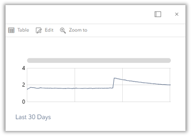
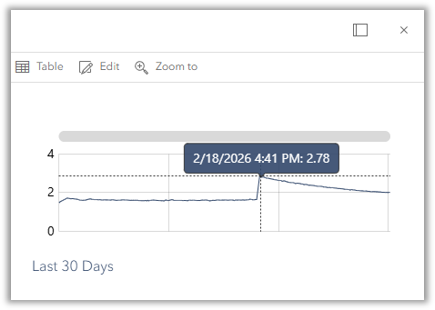
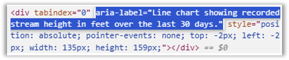

# Building Charts with Arcade

Communicative and effective map viewer popups are essential for any good map-centric COTS web app. Configuration specialists are accustomed to utilizing HTML, CSS, and ArcGIS Arcade to extend what's possible out of the box. Arcade isn't limited to just text formatting and conditional logic though - the expression language can be used to create complex chart visualizations[^1] from input data directly in the popups.
[^1]: Supported chart types include `barchart`, `columnchart`, `linechart`, and `piechart`. See the web map docs [here](https://developers.arcgis.com/web-map-specification/objects/mediaInfo/#properties). `image` is also a supported `value` of the `type` property.

## Use Case
As part of the solution built for the [Missouri Hydrology Information Center](https://mohic.mo.gov) in 2025, I built two web apps using Experience Builder to visualize stream gage data. In these apps, we wanted to build a line chart in the web map popup that could be docked in a [Feature Info widget](https://doc.arcgis.com/en/experience-builder/latest/configure-widgets/feature-info-widget.htm). Explore the flood-focused app [here](https://experience.arcgis.com/experience/c5ac614abce2414b87ebcae926bc9b96) - click on a streamgage to see the chart powered by Arcade.

## The Code
``` javascript linenums="1" title="Stream Gage Height Readings using Arcade"
// calculate past 30 days
var currDate = Now()
var thirDays = DateAdd(currDate, -30, "days")

// create empty dictionary + array for chart
var attributes = {};
var thirFieldInfos = [];

// create FeatureSet for gages
var fs = FeatureSetByRelationshipName($feature, "Gage_Readings");
var thirFs = Filter(fs, 'Time >= @thirDays')

// iterate through gages, pulling stage and time
for (var item in thirFs) {
  var thirStage = item["Stage_ft"];
  if (thirStage < 10000000 && thirStage > -999){
    var thirTimex = Text(item["Time"], "M/DD/YYYY h:mm A");
    attributes[thirTimex] = thirStage;
    Push(thirFieldInfos, thirTimex)
  }
}

return {
  type: "media",
  attributes: attributes,
  title: "",
  mediaInfos: [
    {
      type: "linechart",
      altText: "Line chart showing recorded stream height in feet over the last 30 days.",
      title: "<p style='color:#2C486B;font-weight:300;margin:8px'>Last 30 Days</p>",
      value: {
        fields: thirFieldInfos,
        "colors": [
          [
            44,
            72,
            107
          ]
        ]
      }
    }
  ]
}
```

## Dissecting Further

### Data Setup
I first set up an empty `attributes` dictionary and `thirFieldInfos` array that will store the needed values for my chart. I create a variable `thirDays` to serve as a where clause to filter my data later:

`#!javascript var thirDays = DateAdd(currDate, -30, "days")`

This example works with a related table data strucutre, in which I have a parent stream gage point hosted feature layer in ArcGIS Online with a related `Gage_Readings` table. The `Gage_Readings` table stores stream gage height values every hour. Therefore, I create a FeatureSet `fs` and filter it with my `thirDays` where clause I created earlier:

`#!javascript var thirFs = Filter(fs, 'Time >= @thirDays')`

### Looping Through

I set up a `for` loop to iterate over each feature (or row) in the `thirFs` FeatureSet I've already filtered:

`#!javascript for (var item in thirFs)`

I read the stage height in feet of the current gage reading:

`#!javascript var thirStage = item["Stage_ft"]`

I set up a guard to remove null values in the streamgage network. This dataset inconsistently had values in the millions or -999 to indicate nulls:

`#!javascript if (thirStage < 10000000 && thirStage > -999)`

I format the reading's timestamp into month/day/four digit year hour:minute AM/PM format:

`#!javascript var thirTimex = Text(item["Time"], "M/DD/YYYY h:mm A")`

I map the formatted `thirTimex` string to the `thirStage` value with a key-value pair:

`#!javascript attributes[thirTimex] = thirStage`

Finally, I append the time string into the `thirFieldInfos` array I created earlier:

`#!javascript Push(thirFieldInfos, thirTimex)`

### Output

Why do we need a dictionary *and* an array in the first place? In the return statement, we need both an `attributes` dictionary that contains name/value pairs to supply the chart's data points AND a `fields` array that contains ordered keys referncing which attribtues to plot. The `fields` array goes inside the `mediaInfo` object.

```javascript linenums="1" title="Media Popup Element Return"
 return {
  type: "media",
  attributes: attributes,
  title: "",
  mediaInfos: [
    {
      type: "linechart",
      altText: "Line chart showing recorded stream height in feet over the last 30 days.",
      title: "<p style='color:#2C486B;font-weight:300;margin:8px'>Last 30 Days</p>",
      value: {
        fields: thirFieldInfos,
        "colors": [
          [
            44,
            72,
            107
          ]...
```          

Small detail - notice the `colors` array in the `mediaInfo` object. We use this to set the color of the chart in rgba format (I didn't need the alpha value in this example).

## End Result
The end result is a simple, clean line chart showing stream height over the past 30 days. This chart has a built-in hover effect for users to explore height through time. Notice the `altText` property that has been included in an effort to make this COTS solution more accessible.

<figure markdown="span">
  
  <figcaption>Arcade output</figcaption>
</figure>
<figure markdown="span">
  
  <figcaption>Nice hover effect</figcaption>
</figure>
<figure markdown="span">
  
  <figcaption>Screen reader-friendly</figcaption>
</figure>